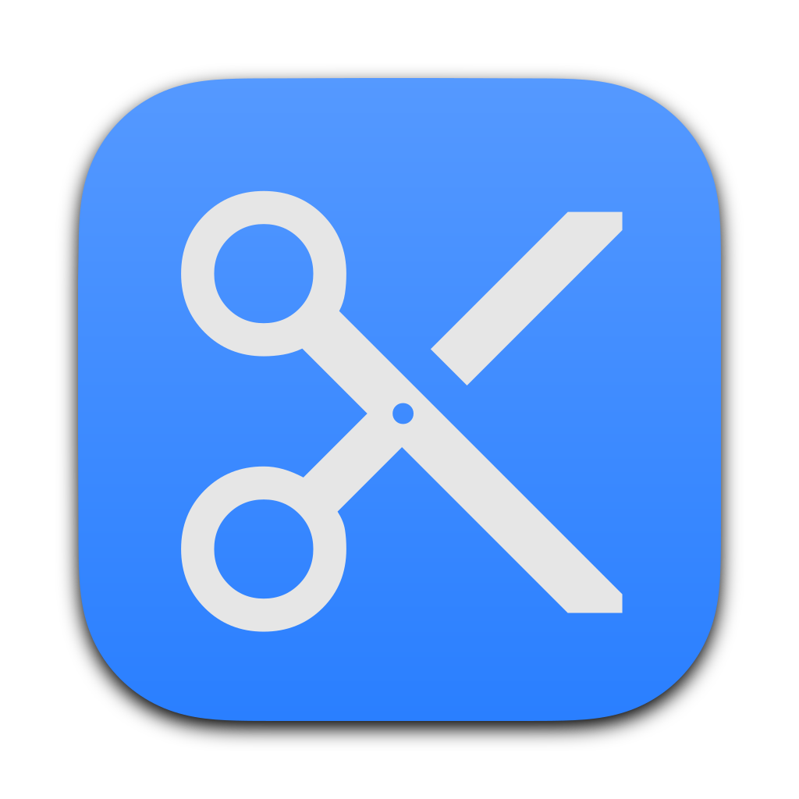

<div align="center">
  <div align="center">
    
  </div>
  <h1 align="center">Cutter</h1>
</div>

GUI app to cut audio files using prerecorded timestamps

## Running the code

### Setting up and running
Clone this directory
```
git clone https://github.com/adithyankv/cutter.git
```
navigate into the directory and create a virtual environment
```
python3 -m venv .venv
```
activate the virtual environment
```
source .venv/bin/activate
```
install the dependencies
```
pip install -r requirements.txt
```
run the app
```
python3 app.py
```

### Building a MacOS executable
To create a MacOS application, Install pyinstaller in your virtual environment
```
pip install pyinstaller
```
then run
```
pyinstaller app-macos.spec
```
